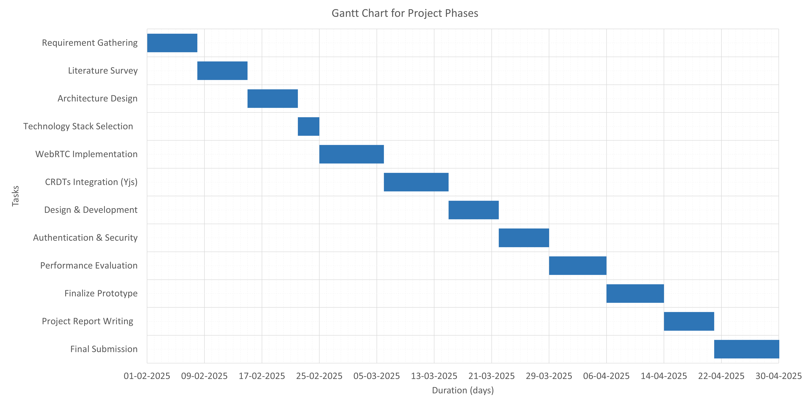
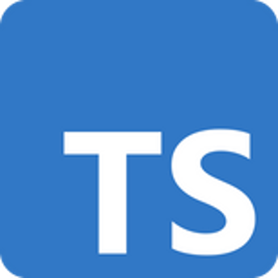
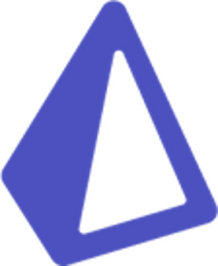
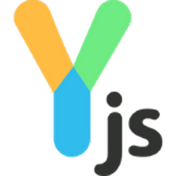
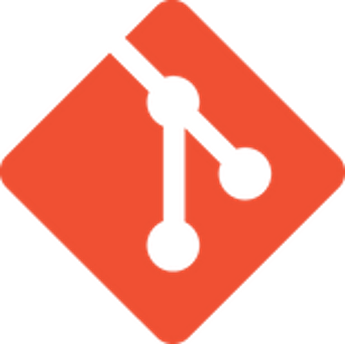
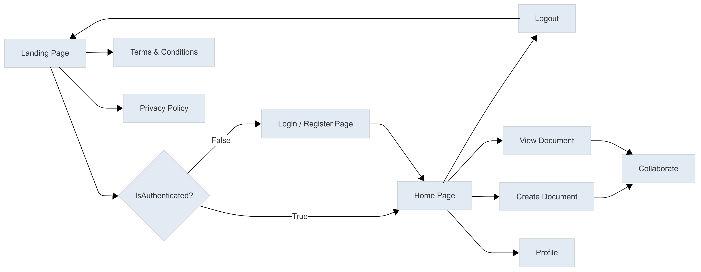

## Title:

LiveDocs: A Peer-to-Peer Real-Time Collaborative Document Editor Using WebRTC and CRDTs

| Team Members      | Reg. No.     |
| ----------------- | ------------ |
| Charankumar E G D | 921321205029 |
| Arunprasad S      | 921321205015 |
| Dharani Dharan R  | 921321205032 |

| Mentor                                                                       |
| ---------------------------------------------------------------------------- |
| Mrs. A. Sangeetha, M.E., Ph.D., Assistant Professor - Information Technology |

| Date       |
| ---------- |
| XX/0X/2025 |

## Abstract:

LiveDocs is a decentralized, real-time collaborative document editor designed to enable seamless and efficient collaboration without reliance on centralized servers. Unlike traditional cloud-based solutions such as Google Docs, LiveDocs utilizes WebRTC for direct peer-to-peer (P2P) communication and Yjs (Conflict-Free Replicated Data Types – CRDTs) for distributed data synchronization. This architecture ensures low-latency collaboration, enhanced fault tolerance, and seamless scalability, supporting millions of concurrent users.

Key features include real-time editing, role-based access control, and instant notifications, all powered by a resilient P2P network. Secure authentication is ensured through JWT-based access control, enabling efficient document indexing and user management while delivering a modern and sleek user experience.

By eliminating centralized infrastructure, LiveDocs reduces server costs, enhances scalability, and improves fault tolerance, making it an ideal solution for teams, enterprises, and large-scale applications requiring secure and real-time document collaboration.

## Problem Statement:

Traditional real-time document editors face significant challenges due to high latency and dependence on centralized servers for synchronization and storage. This reliance introduces scalability limitations, single points of failure, and potential privacy risks. As user demand increases, latency issues degrade the collaborative experience, making real-time editing less efficient. To address these challenges, a decentralized approach is required to ensure low-latency, fault-tolerant, and scalable real-time document collaboration without reliance on a central server.

## Objective of LiveDocs

- Develop a decentralized editor to eliminate reliance on central servers and enhance scalability.

- Leverage WebRTC-based P2P communication for low-latency and efficient real-time collaboration.

- Integrate Yjs (CRDTs) to enable seamless, conflict-free data synchronization across users.

- Provide an intuitive UI with modern design for a smooth and responsive editing experience.

- Ensure security with JWT authentication, role-based access, and real-time notifications.

## Literature Survey

| Title                                                                                   | Author(s) & Year                                                                  | Approach                                                                                                                                                                            | Limitations                                                                                                                                   | Link                                                                                           |
| --------------------------------------------------------------------------------------- | --------------------------------------------------------------------------------- | ----------------------------------------------------------------------------------------------------------------------------------------------------------------------------------- | --------------------------------------------------------------------------------------------------------------------------------------------- | ---------------------------------------------------------------------------------------------- |
| Performance of real-time collaborative editors at large scale: User perspective         | Quang-Vinh Dang, Claudia-Lavinia Ignat - 2016                                     | Evaluates large-scale collaborative editors using user interaction data and system logs to assess responsiveness and consistency.                                                   | Performance degradation observed under high concurrency, limited consideration for network partition scenarios.                               | [https://ieeexplore.ieee.org/document/7497258](https://ieeexplore.ieee.org/document/7497258)   |
| A Personal Distributed Real-time Collaborative System                                   | Michalis Konstantopoulos, Nikos Chondros, Mema Roussopoulos - 2020                | A distributed peer-to-peer (P2P) collaborative editing system with decentralized storage, reducing reliance on central servers.                                                     | Consistency management becomes complex when multiple users edit simultaneously; relies heavily on stable peer connectivity.                   | [https://ieeexplore.ieee.org/document/10117106](https://ieeexplore.ieee.org/document/10117106) |
| Collaborative Code Editors - Enabling Real-Time Multi-User Coding and Knowledge Sharing | Khushwant Virdi, Anup Lal Yadav, Azhar Ashraf Gadoo, Navjot Singh Talwandi - 2023 | Examines collaborative code editors, focusing on WebSocket communication, OT algorithms, and conflict resolution, with a prototype evaluation and comparison to existing platforms. | Persistent issues like latency, synchronization, and conflict resolution remain, requiring further innovation for larger-scale effectiveness. | [https://ieeexplore.ieee.org/document/10325722](https://ieeexplore.ieee.org/document/10325722) |
| SecureC2Edit: A Framework for Secure Collaborative and Concurrent Document Editing      | Shashank Arora, Pradeep K. Atrey - 2023                                           | Proposes a secure framework for concurrent collaborative editing, integrating cryptographic controls to ensure content integrity.                                                   | Increased processing overhead due to encryption; real-time performance is affected in low-bandwidth environments.                             | [https://ieeexplore.ieee.org/document/9036818](https://ieeexplore.ieee.org/document/9036818)   |

## Gantt Chart

## Proposed Methodology

- Use Next.js for the frontend with a custom collaborative editor.

- Apply Yjs (CRDTs) for real-time updates and conflict resolution.

- Leverage WebRTC for direct peer-to-peer communication and low latency.

- Implement JWT authentication for secure access control.

- Store documents in PostgreSQL for reliable backups and fast access.

- Enable collaboration features like presence, comments, roles, and notifications.

- Optimize WebRTC and CRDTs for low latency, scalability, and efficient sync.

## Tools & Frameworks

  
  
  
  
  
  
  
  
  
  
  
  
</->

## Flow Chart

## Prototype

## Thankyou
