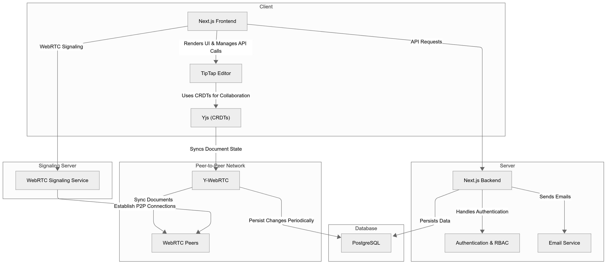
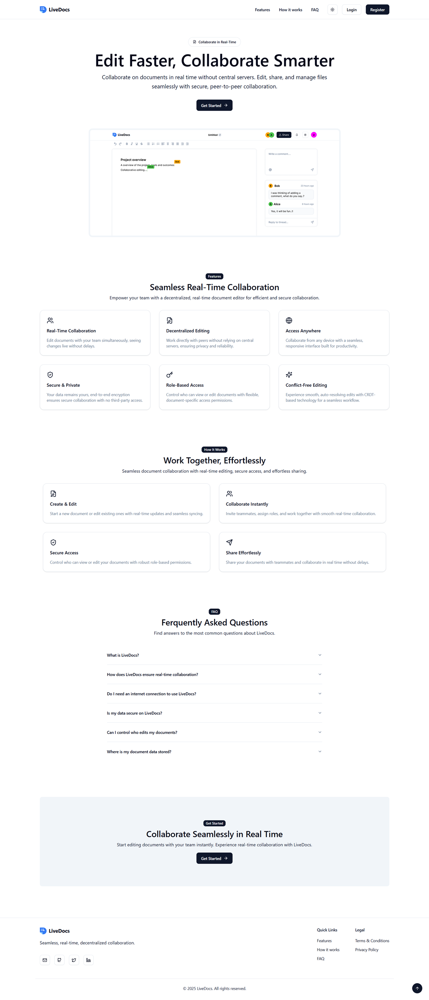
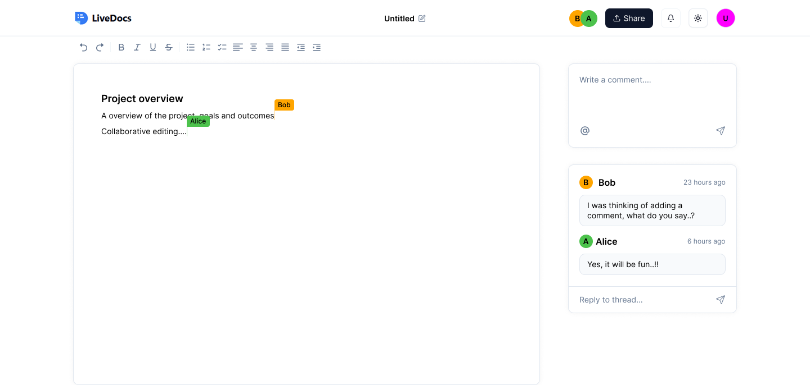
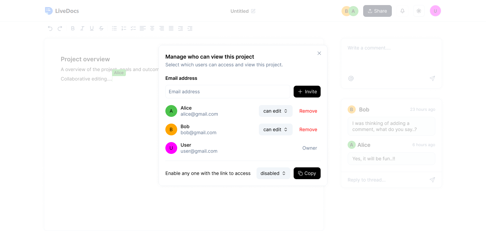
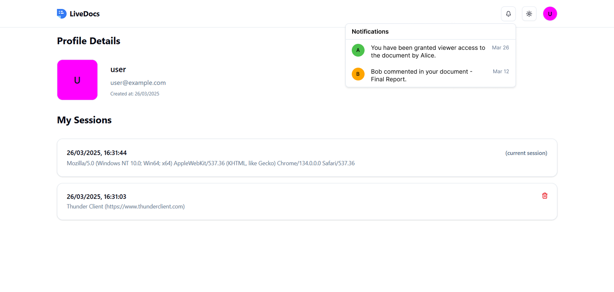

# Title

LiveDocs: A Peer-to-Peer Real-Time Collaborative Document Editor Using WebRTC and CRDTs

# Authors

- Charankumar E G D, Department of Information Technology, PSNA College of Engineering and Technology, Dindigul, Tamil Nadu, India, charankumaregd21it@psnacet.edu.in
- Arunprasad S, Department of Information Technology, PSNA College of Engineering and Technology, Dindigul, Tamil Nadu, India, arunprasads21it@psnacet.edu.in
- Dharani Dharan R, Department of Information Technology, PSNA College of Engineering and Technology, Dindigul, Tamil Nadu, India, dharanidharanr21it@psnacet.edu.in
- A. Sangeetha, Department of Information Technology, PSNA College of Engineering and Technology, Dindigul, Tamil Nadu, India, sangeetha@psnacet.edu.in

# Abstract

LiveDocs is a decentralized, real-time collaborative document editor designed to enable seamless and efficient collaboration without reliance on centralized servers. Unlike traditional cloud-based solutions such as Google Docs, LiveDocs utilizes WebRTC for direct peer-to-peer (P2P) communication and Yjs (Conflict-Free Replicated Data Types: CRDTs) for distributed data synchronization. This architecture ensures low-latency collaboration, enhanced fault tolerance, and seamless scalability, supporting millions of concurrent users.

Key features include real-time editing, role-based access control, and instant notifications, all powered by a resilient P2P network. Secure authentication is ensured through JWT-based access control, enabling efficient document indexing and user management while delivering a modern and sleek user experience.

By eliminating centralized infrastructure, LiveDocs reduces server costs, enhances scalability, and improves fault tolerance, making it an ideal solution for teams, enterprises, and large-scale applications requiring secure and real-time document collaboration.

# Keywords

Peer-to-Peer Collaboration, Real-Time Document Editing, WebRTC, CRDTs (Yjs), Decentralized Collaboration, JWT Authentication

# 1. Introduction

## 1.1 Background and Motivation

Today, in the age of digitalization, real-time collaboration is a necessity for the efficiency and productivity of a team. Google Docs and Microsoft Office 365 are cloud-based document editors that have changed the way we work together. However, these platforms have their disadvantages, such as dependence on a centralized server, and the problem of delay in latency. The platforms need the servers to be available all the time, and the bottlenecks can limit the scalability, especially when a large number of users are working at the same time.

To address these challenges, decentralized and peer-to-peer (P2P) collaboration models have come into the spotlight. WebRTC provides peer-to-peer communication. This eliminates the need for servers. Data synchronization in distributed environments can be done using Conflict-Free Replicated Data Types (CRDTs) such as Yjs. Therefore, a distributed, scalable, fault-tolerant collaborative editing system can be developed.

## 1.2 Problem Statement

Most of the real-time document collaboration tools that we have now are server dependent. This leads to:

- High infrastructure: The maintenance of centralized servers is not easy. Real-time editing requires significant resources.

- Scalability Limitations: Server-based architectures have a hard time efficiently managing millions of concurrent users.

- Latency Issues: When users are geographically separated, they may experience delays because of server based synchronization.

Decentralized peer-to-peer (P2P) document collaboration system can solve these problems by allowing direct communication between users, reducing dependence on central servers, and ensuring efficient data synchronization through CRDTs.

## 1.3 Objectives and Contributions

LiveDocs aims to provide a decentralized, real-time collaborative document editor that has no dependence on central-server, ensuring low-latency, fault-tolerant and scalable collaboration. The main contributions of this project are as follows:

- Decentralized Peer-to-Peer Communication: Using WebRTC technology to allow users to communicate directly, minimizing reliance on central servers.

- Conflict-free Real Time Collaboration: Implementing Yjs (CRDTs) and use its implementation for shared state.

- Authentication Access Control: Adding JWT-based authentication for user security and access control

- Modern And Reliable User Experience: A feature-rich modern text editing UI with real time updates and granular collaborative editing features.

By this, LiveDocs provides a simple, cost-effective, scalable, and secure alternative to traditional cloud-based document editors, where the centralized server has been eliminated, thus making it the best fit for enterprises, research teams, and large-scale collaboration use cases.

# 2. Literature Review

## 2.1 Overview of Existing Systems

Real-time collaborative editing has emerged as a critical area of research and development, enabling multiple users to modify a shared document simultaneously. Prominent existing systems, such as Google Docs and Etherpad, utilize centralized architectures to maintain document consistency and ensure availability [1]. These platforms have gained widespread adoption due to their user-friendly interfaces and seamless cloud integration. However, as the number of concurrent users increases, these systems experience scalability issues, leading to performance degradation and increased latency [1].

Collaborative coding environments have also seen advancements, particularly in enabling real-time multi-user interactions. Virdi et al. [2] examined various collaborative code editors, which employ WebSocket-based communication and Operational Transformation (OT) algorithms for maintaining synchronization. Despite the benefits of these systems in fostering real-time collaboration among distributed software development teams, persistent issues such as synchronization delays and conflict resolution complexities hinder their efficiency at scale [2].

Security and privacy remain significant concerns in real-time collaborative editing. Arora and Atrey [3] proposed SecureC2Edit, a secure collaborative editing framework that encrypts user data before storing it on cloud servers. This framework enhances data privacy by ensuring that plaintext user content is never exposed to cloud-based storage providers. However, encryption-based solutions introduce additional computational overhead, which may impact the responsiveness of real-time collaboration [3].

A shift towards decentralized collaborative editing systems has been proposed as an alternative to centralized platforms. Konstantopoulos et al. [4] introduced O3 REAL, a peer-to-peer (P2P) system for real-time collaboration. O3 REAL employs a reliable broadcast mechanism for network communication and utilizes a distributed filesystem for document storage. This decentralized approach eliminates reliance on third-party servers, thereby improving fault tolerance and scalability [4]. Notably, O3 REAL demonstrated low latency and high efficiency in collaborative editing, making it a promising direction for future real-time collaborative systems.

## 2.2 Limitations of Current Approaches

Despite significant progress in real-time collaborative editing, existing solutions exhibit notable limitations:

- Scalability and Performance Constraints: As noted by Dang and Ignat [1], mainstream collaborative editing platforms such as Google Docs and Etherpad struggle with increased user concurrency, leading to higher latency. This negatively affects user experience and restricts their applicability in large-scale collaborative settings.
- Synchronization and Consistency Challenges: Collaborative code editors, as discussed by Virdi et al. [2], rely on OT-based synchronization mechanisms, which become computationally expensive and complex when handling simultaneous modifications from multiple users.
- Security and Privacy Risks: Cloud-based collaborative systems expose sensitive user data to potential security breaches. While SecureC2Edit [3] mitigates these risks through encryption, it introduces additional processing overhead that impacts real-time responsiveness.
- Dependence on Centralized Infrastructure: The reliance on cloud-based infrastructures results in single points of failure, higher operational costs, and potential vendor lock-in. While decentralized solutions such as O3 REAL [4] address some of these concerns, they do not fully resolve real-time synchronization challenges over peer-to-peer networks.

## 2.3 Positioning of the Proposed Work

LiveDocs is designed to address the limitations of existing real-time collaborative editing systems by leveraging a decentralized P2P architecture and Conflict-Free Replicated Data Types (CRDTs) for efficient synchronization. Unlike Google Docs and Etherpad, which rely on cloud-based architectures and experience increased latency with higher user loads, LiveDocs utilizes WebRTC to enable direct peer-to-peer communication, reducing server dependency and minimizing delays.

Collaborative coding environments predominantly use OT-based synchronization; however, LiveDocs adopts Yjs, a CRDT-based approach that simplifies conflict resolution while maintaining real-time consistency. This methodology eliminates the complexity associated with traditional operational transformations and improves performance in multi-user editing scenarios.

Furthermore, LiveDocs enhances security and privacy by eliminating centralized server, ensuring that document content remains confined within the P2P network. This decentralized model builds upon the principles introduced by O3 REAL [4], while integrating PostgreSQL for persistence mechanisms to improve data reliability and synchronization efficiency.

By incorporating a robust P2P communication model, CRDT-based synchronization, and enhanced security measures, LiveDocs presents a novel solution that surpasses the scalability, performance, and privacy limitations of existing real-time collaborative editing systems. This framework provides a viable alternative to traditional centralized approaches, paving the way for a more efficient and secure collaborative editing experience.

# 3. System Architecture

## 3.1 Overview of LiveDocs

LiveDocs is a P2P real-time collaborative document editor which means that multiple users can edit the document at the same time and there is no centralized server involved for collaboration. It uses WebRTC to connect users to each other and Yjs (CRDTs) to sync data that won't conflict. This decentralized architecture allows to achieve low latency, fault tolerance, and scalability. There are three main components of the system:

- Client-Side Application: A web-based text editor offering a real-time collaborative, modern user interface.

- Real-Time Collaboration Module: Uses WebRTC for a P2P communication channel and Yjs for efficient data synchronization.

- Authentication & Access Control: Uses JWT for authentication and role-based permissions for secured document access.

## 3.2 Architectural Design

In the architecture of LiveDocs, every module is designed to achieve collaboration without comprising efficiency, security and scalability.

### 3.2.1 Client-Side Components

The client-side of LiveDocs consists of:

- Tiptap-based Text Editor: Provides a rich text editing experience that supports headings, lists, text formatting, and more, with a real-time collaborative experience.

- WebRTC Signalling Mechanism: Establishes P2P connections using a preliminary signalling process (like WebSocket or a lightweight signalling server).

- Yjs Document Synchronization: Provides real-time updates for text changes and efficiently performs operation merging with CRDTs.

- User Interface (UI) Components: Encompasses document management, notifications, and user collaboration tools.

### 3.2.2 Real-Time Collaboration Module

The real-time collaboration module is responsible for synchronizing document changes across users. It works as follows:

- WebRTC Connection Establishment: When a user joins a document session, a WebRTC connection is established with other peers.

- Change Detection and Distribution: User edits are captured and distributed to other peers using Yjs.

- Conflict-Free Merging: CRDTs ensure that all document changes are merged seamlessly without conflicts.

### 3.2.3 Peer-to-Peer Network Topology

LiveDocs supports different P2P topologies:

- Mesh Network: Each client directly connects to others, ideal for small groups.

- Hybrid P2P with a Lightweight Server: A signalling server helps establish connections but does not handle document data.

- Distributed Relay Mechanism: If direct P2P connections fail due to network restrictions, TURN servers can be used as a fallback.

## 3.3 Data Synchronization using Yjs

Yjs (a CRDT library) is used for:

- Efficient Document State Management: Ensures that all peers have a consistent version of the document.

- Optimized Data Transmission: Uses delta-based updates to minimize network overhead.

- Offline Support: Changes made offline are automatically merged when the user reconnects.

## 3.4 Authentication and Access Control

To ensure security, LiveDocs implements:

- JWT-based Authentication: Users authenticate using JSON Web Tokens (JWT) to gain access.

- Role-Based Access Control (RBAC): Different permission levels (owner, editor, viewer) are assigned to users.

- Secure Document Sharing: Documents can be shared via encrypted links with access restrictions.

## 3.5 Scalability and Fault Tolerance

LiveDocs is designed to handle a high number of users efficiently:

- Decentralized Collaboration: Since there are no central servers, the system scales naturally with more peers.

- Resilient Data Synchronization: Yjs ensures that document consistency is maintained even in cases of network failures.

- Fallback Mechanisms: If direct WebRTC connections fail, alternative routing methods like STUN/TURN servers are used.

# 4. Implementation Details

## 4.1 Technology Stack

LiveDocs is built using modern web technologies to ensure efficient real-time collaboration, scalability, and security. The technology stack includes:

- Frontend: Next.js (React), TypeScript, Tailwind CSS, Tiptap (rich-text editor)

- Backend: Next.js API, PostgreSQL (with an ORM like Prisma)

- Real-Time Collaboration: WebRTC for peer-to-peer communication, Yjs (CRDTs) for conflict-free synchronization

- Authentication & Security: JWT-based authentication, role-based access control

## 4.2 Backend Implementation

### 4.2.1 Authentication Mechanism

Authentication is managed using JSON Web Tokens (JWT) to ensure secure access control and document collaboration.

- Users authenticate via an email/password login system that issues JWTs upon successful authentication.

- Access to documents is validated using JWT tokens and Database before establishing a WebRTC connection for real-time collaboration.

- Expired or invalid JWTs prevent access, ensuring only authorized users can participate in document editing.

### 4.2.2 Document Storage and Retrieval

LiveDocs ensures efficient and decentralized document storage and retrieval, balancing real-time collaboration with data persistence.

- Documents are stored in PostgreSQL using Prisma ORM, ensuring structured and reliable data persistence.

- Yjs (CRDTs) enables real-time, conflict-free document editing across multiple users.

- When a user accesses a document, LiveDocs retrieves the latest persisted state from PostgreSQL. The document state is then synchronized using Y-WebRTC, allowing peer-to-peer collaboration.

- Changes made during collaboration are periodically persisted to PostgreSQL. When no active users remain, the final document state is saved to ensure data integrity.

- Access to documents is validated using document-specific roles. Only authorized users (editor/viewer) can retrieve or modify document content.

## 4.3 Frontend Implementation

### 4.3.1 Real-Time Editing Interface

- TipTap Integration: The editor supports rich-text formatting, comments, and user mentions.

- Live Collaboration: Changes made by users are instantly reflected using Yjs and Y-WebRTC for peer-to-peer synchronization.

- Role-Based Editing: Users with editor roles can modify the document, while viewers have read-only access.

- Auto-Saving & Persistence: Changes are periodically saved to PostgreSQL to maintain consistency.

### 4.3.2 User Interaction and Notifications

- User Presence Indicators: Displays active users with unique colours/cursors.

- Commenting System: Users can add comments, mention collaborators, and reply.

- Toast notifications for real-time document updates, mentions, and access changes.

- In-app notifications for document invitations, edits, and session expirations.

## 4.4 Peer-to-Peer Communication with WebRTC

- WebRTC Signalling: A signalling server initializes peer connections before switching to direct communication.

- Direct Data Transmission: Once connected, users exchange updates without a central server, reducing latency.

- Secure Access Control: WebRTC connections are validated using JWTs, ensuring only authorized users can participate.

## 4.5 Data Conflict Handling with CRDTs

- Yjs (CRDT-based sync): Ensures conflict-free merging of simultaneous edits.

- Offline Editing Support: Users can edit documents offline, and changes sync when reconnected.

- Automatic Conflict Resolution: Unlike traditional version control, Yjs ensures a single source of truth without merge conflicts.

## 4.6 Prototype Demonstration

# 5. Performance Evaluation

Evaluating the performance of LiveDocs is crucial to understanding its efficiency, scalability, and reliability in real-world usage. This section outlines key evaluation metrics, experimental results, and a comparative analysis with existing solutions.

## 5.1 Latency

In a mesh network, latency is optimized due to direct peer-to-peer (P2P) communication, eliminating the need for centralized servers and reducing transmission delays. Parallel data propagation ensures faster synchronization, as updates can reach multiple peers simultaneously rather than passing through a central relay. WebRTC’s adaptive congestion control dynamically adjusts data flow based on network conditions, minimizing lag. Additionally, localized update distribution allows peers to exchange only necessary changes rather than full document states, reducing bandwidth usage and improving real-time responsiveness. These advantages make mesh networks highly efficient for low-latency collaboration, especially in decentralized applications like LiveDocs.

## 5.2 Scalability

Scalability in LiveDocs is achieved through its decentralized peer-to-peer (P2P) architecture, eliminating server bottlenecks and enabling direct communication between users. In a mesh network, peers dynamically establish connections, distributing the load efficiently without overloading a central server. WebRTC’s adaptive bandwidth management ensures stable performance even as the number of participants grows, while Yjs (CRDTs) efficiently synchronize document states, reducing data transmission overhead. To further enhance scalability, peer clustering and selective relay techniques limit redundant connections, optimizing network traffic. This architecture allows LiveDocs to scale seamlessly to thousands of users, making it ideal for large teams and distributed collaboration.

## 5.3 Synchronization Accuracy

Synchronization accuracy in LiveDocs is ensured through Yjs (CRDTs), which guarantees conflict-free merging of concurrent edits without data loss. Since CRDTs operate in a distributed environment, they enable automatic state reconciliation, ensuring that all peers maintain a consistent document version, even in the presence of network partitions or delayed updates. Unlike traditional Operational Transformation (OT) methods, Yjs allows real-time synchronization without requiring a central authority, reducing latency and improving reliability. Additionally, differential updates ensure that only minimal data changes are transmitted, further enhancing efficiency. This approach ensures that every user sees the same document state, regardless of the number of edits or network conditions.

# 6. Discussion

## 6.1 Strengths of LiveDocs

LiveDocs introduces a decentralized, real-time collaborative document editing system that eliminates the limitations of centralized cloud-based solutions. The key strengths of the system include:

- Decentralized Architecture: Unlike traditional document editors that rely on central servers, LiveDocs leverages WebRTC for direct peer-to-peer (P2P) communication, ensuring reduced latency and improved performance.

- Efficient Data Synchronization: By using Yjs (CRDTs), LiveDocs ensures conflict-free, real-time collaboration without requiring a central authority for resolving document edits.

- Scalability: Since LiveDocs operates on a P2P network, the system can scale dynamically without bottlenecks, supporting millions of concurrent users.

- Fault Tolerance: The distributed nature of the system ensures that document collaboration continues even if some peers disconnect, enhancing reliability.

- Security and Privacy: With JWT-based authentication and end-to-end encryption, LiveDocs offers enhanced security, ensuring that only authorized users can access and edit documents.

- Cost Efficiency: Eliminating the need for centralized infrastructure significantly reduces server costs, making the system more sustainable.

## 6.2 Limitations and Challenges

Despite its advantages, LiveDocs faces several challenges that need to be addressed for broader adoption:

- Network Dependencies: WebRTC requires a stable network connection for efficient peer-to-peer communication.

- Increased Client-Side Resource Usage: Since document processing is handled on the client side rather than a central server, devices with lower processing power may experience performance issues.

- Security Risks: While JWT provides authentication, additional measures such as end-to-end encryption and access control policies need to be enforced to prevent unauthorized data access.

- High Latency and Network Overhead: Mesh networks require each peer to maintain multiple direct connections, leading to increased bandwidth usage and higher latency as the network scales.

## 6.3 Future Enhancements

To further enhance LiveDocs, the following improvements can be considered:

- Optimized Peer Discovery: Enhancing the P2P network with efficient peer discovery mechanisms to reduce connection latency and improve collaboration in large-scale environments.

- Better Mobile Support: Developing optimized WebRTC handling for mobile networks, including adaptive bandwidth management and reduced battery consumption strategies.

- End-to-End Encryption: Strengthening security and ensuring that document content remains private even if intercepted.

- AI-Powered Collaboration Features: Adding AI-driven features such as smart suggestions, real-time grammar correction, and intelligent summarization to enhance user experience.

- Integration with Other Tools: Allowing integration with existing platforms like Git, Notion, and Trello to expand usability and collaboration possibilities.

By addressing these challenges and implementing future enhancements, LiveDocs can become a highly efficient, scalable, and secure solution for real-time decentralized document collaboration, offering an innovative alternative to traditional cloud-based tools.

# 7. Conclusion

LiveDocs presents a decentralized, peer-to-peer (P2P) real-time collaborative document editor that eliminates the dependency on centralized servers, reducing costs while improving scalability, fault tolerance, and privacy. By leveraging WebRTC for direct communication and Yjs (CRDTs) for efficient data synchronization, the system ensures low-latency collaboration, even in large-scale environments.

The project successfully addresses major challenges associated with traditional cloud-based editors, including high infrastructure costs, data privacy risks, and scalability limitations. Additionally, JWT-based authentication enhances security by providing controlled access to documents, while the decentralized nature of the system reduces the risks of single points of failure.

Despite its strengths, LiveDocs faces certain limitations, such as network dependency, increased client-side resource consumption, and data persistence challenges. Future enhancements, including hybrid cloud storage, optimized peer discovery, improved mobile support, and AI-driven collaboration tools, will further enhance the system’s performance and usability.

Overall, LiveDocs offers a robust, scalable, and privacy-focused alternative to traditional document collaboration tools, making it ideal for enterprises, remote teams, and research communities seeking secure and real-time document editing solutions.

# 8. References

1. Q. -V. Dang and C. -L. Ignat, "Performance of real-time collaborative editors at large scale: User perspective," 2016 IFIP Networking Conference (IFIP Networking) and Workshops, Vienna, Austria, 2016, pp. 548-553, doi: 10.1109/IFIPNetworking.2016.7497258.

2. K. Virdi, A. L. Yadav, A. A. Gadoo and N. S. Talwandi, "Collaborative Code Editors - Enabling Real-Time Multi-User Coding and Knowledge Sharing," 2023 3rd International Conference on Innovative Mechanisms for Industry Applications (ICIMIA), Bengaluru, India, 2023, pp. 614-619, doi: 10.1109/ICIMIA60377.2023.10426375.

3. S. Arora and P. K. Atrey, "SecureC2Edit: A Framework for Secure Collaborative and Concurrent Document Editing," in IEEE Transactions on Dependable and Secure Computing, vol. 21, no. 4, pp. 2227-2241, July-Aug. 2024, doi: 10.1109/TDSC.2023.3302810.

4. M. Konstantopoulos, N. Chondros and M. Roussopoulos, "A Personal Distributed Real-time Collaborative System," 2020 IEEE 26th International Conference on Parallel and Distributed Systems (ICPADS), Hong Kong, 2020, pp. 709-715, doi: 10.1109/ICPADS51040.2020.00101.
